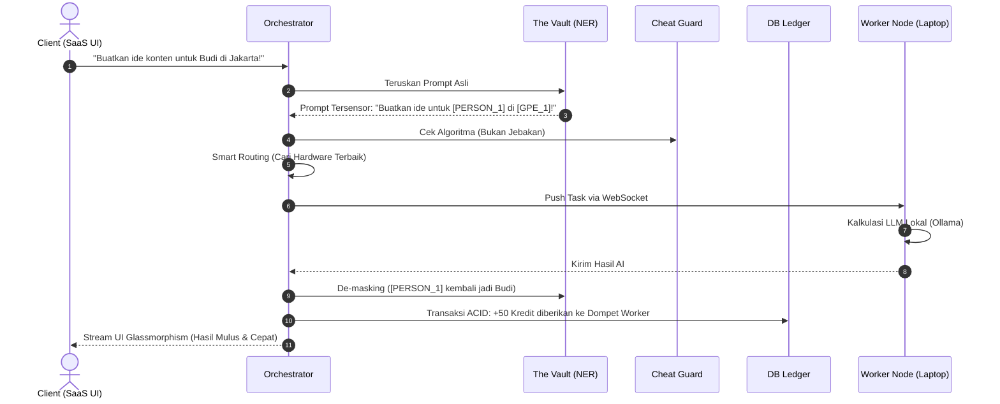

# 🌐 TheWeech AI Mesh

> **Decentralized Physical Infrastructure Network (DePIN) & Compute-to-Earn Ecosystem** khusus dirancang untuk Kreator Konten dan Agensi Lokal Indonesia.

TheWeech mentransformasi ratusan PC/Laptop menganggur milik komunitas menjadi satu superkomputer terdistribusi untuk melayani *Artificial Intelligence* tanpa mengandalkan korporasi server luar negeri.

---

## 💡 1. Ide Konsep
**TheWeech** adalah kombinasi dari **SaaS (Software as a Service)** untuk Solopreneur/Kreator dan **Grid Komputasi Terdesentralisasi**. 

Alih-alih membayar biaya API LLM *(seperti OpenAI/Anthropic)* yang mahal secara sentral, perangkat lunak ini mendelegasikan tugas analisis teks AI kepada komputer-komputer rumahan relawan (*Worker Nodes*). Sebagai gantinya, relawan mendapatkan kompensasi berupa **Kredit Komputasi** (Compute-to-Earn) yang bisa ditukarkan dengan akun Pro Premium TheWeech tanpa harus membayar sepeser Rupiah pun.

## 🎯 2. Masalah yang Ingin Diselesaikan
1. **Membengkaknya HPP (Cost of Goods Sold):** Start-up AI sering gulung tikar akibat biaya token server cloud (OpenAI/Claude) yang sangat mahal. TheWeech memangkas ongkos ini hingga 70% dengan melempar tugas ke jaringan PC relawan.
2. **Kekhawatiran Kebocoran Privasi (Zero-Trust):** Kreator tidak ingin rahasia riset pasar mereka dibaca oleh pihak ketiga. TheWeech menyelesaikan ini dengan pipa **"The Vault"** — semua nama orang, tempat, dan entitas sensitif akan "di-sensor" secara algoritmik sebelum dikirim ke komputer relawan komunitas.
3. **Monetisasi Hardware Pasif:** Jutaan PC gaming/laptop di Indonesia menyala tanpa tugas berat saat pengguna sedang mengetik/browsing. TheWeech mengutilisasi *idle CPU/GPU* ini menjadi mesin pencetak uang/akun Pro bagi pemiliknya.

## 🛠️ 3. Tech Stack
- **Pusat Komando (Orchestrator):** Python 3.12, FastAPI, Uvicorn, WebSockets.
- **Node Pekerja (Worker Engine):** Python, `psutil` (Telemetry), Ollama API lokal (Gemma/Llama3).
- **Keamanan Data (The Vault):** Algoritma *Named Entity Recognition* (NER) dengan SpaCy (`id_core_news_sm`).
- **Database & Ledger:** SQLite, SQLAlchemy (Asynchronous).
- **Antarmuka (Frontend):** Vanilla Javascript, HTML5, CSS3 bergaya *Glassmorphism* dan *Premium UI*.

## 📂 4. Struktur Project
```text
TheWeech/
├── orchestrator/           ← Pusat Komando SaaS & Load Balancer
│   ├── core/               ← Jantung Arsitektur:
│   │   ├── cheat_guard.py  # Anti-Spoofing & Hacker Protection
│   │   ├── vault.py        # Data Sanitization (Masking/Unmasking)
│   │   ├── models.py       # Skema Database Ledger AI
│   │   └── connection_manager.py # Smart Routing & Telemetry Worker
│   ├── routes/             
│   │   ├── wallet.py       # API Sistem Gamifikasi & Billing
│   │   └── worker_ws.py    # Tunnel Komunikasi WebSocket P2P
│   └── templates/          # Frontend Dashboard (HTML/JS)
├── worker-node/            ← Klien Desktop untuk Relawan Komunitas
│   └── worker.py           # Menjalankan Ollama & Melapor Status Hardware
├── docs/                   ← Script Uji Coba Militer (QA)
│   ├── test_e2e.py         # End-to-end load dispatcher
│   └── test_failover.py    # Uji ketahanan "Zombie Worker" (Kabel cabut)
├── ROADMAP.MD              ← Dokumen Induk Pengembangan (Fase 1-10)
└── README.md               ← File dokumentasi ini
```

## 👥 5. Use Case TheWeech
### A. Klien SaaS (Misal: Manajer Kreator / UMKM)
Klien masuk ke dashboard TheWeech untuk meminta **Analisis User DNA** (menganalisis 500 komentar audiens YouTube mereka). Klien ini tidak tahu menahu soal mesin yang memproses. Di mata mereka, TheWeech dengan cepat menyediakan insight matang dalam antarmuka web modern dengan kecepatan kurang dari hitungan detik.

### B. Relawan Node (Kasta Bronze, Silver, Gold)
Seorang relawan (misal: Rendi) menyalakan script `worker.py` di Laptop *Gaming* miliknya. Laptop Rendi dideteksi memiliki RAM dan CPU tinggi (Kasta Gold). Begitu ada tugas analisis berat dari Klien SaaS, Orchestrator langsung menembakkannya ke laptop Rendi.
Rendi rebahan dan membiarkan layar laptop bekerja, sementara indikator poin TheWeech Wallet-nya terus mendulang puluhan **Kredit Komputasi** secara live, yang besoknya bisa ia *Redeem* (Tukarkan) untuk mencoba fitur-fitur berbayar.

## 🔄 6. Flow Chart (Alur Arsitektur Resolusi Tinggi)



## ⚙️ 7. Setup dan Jalankan (Alpha Testnet)

Lakukan di dua instansi terminal Windows/PowerShell (Makin banyak terminal Worker, Load Balancer semakin pintar).

### Langkah 1: Jalankan Orchestrator (Backend SaaS)
```powershell
# 1. Buka Terminal Pertama
cd "d:\0. Kerjaan\TheWeech\orchestrator"
python -m venv .venv
.venv\Scripts\activate

# Install dependensi
pip install -r requirements.txt
copy .env.example .env

# Jalankan
python main.py
```
> 🌍 Akses UI Premium Dashboard di: `http://127.0.0.1:8000`

### Langkah 2: Jalankan Mesin AI Pekerja (Worker Node)
*Pastikan aplikasi [Ollama](https://ollama.com/) Anda telah di-download dan terinstall secara lokal di PC Anda.*

```powershell
# 2. Buka Terminal Kedua (JANGAN matikan yang pertama)
cd "d:\0. Kerjaan\TheWeech\worker-node"
python -m venv .venv
.venv\Scripts\activate

# Install komponen
pip install -r requirements.txt
copy .env.example .env

# Jalankan Node
python worker.py
```

### Langkah 3: Saksikan Keajaibannya (Fase Pengujian)
Setelah `worker.py` melaporkan *Connected as worker-001*, silakan masuk ke `http://127.0.0.1:8000`. Anda akan melihat:
1. Widget spesifikasi PC Anda.
2. Form Input. Cobalah mengetikkan tugas panjang.
3. Koin/Kredit Komputasi di *Wallet* akan bertambah seiring Task yang berhasil Anda kerjakan via Jaringan Mesh Anda sendiri!
